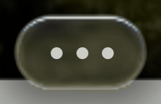

# 加载动画：弹簧运动与居中排布

此为上一版往返动画的历史记录；最新确认方案及验证见[从左进入、依次推动、向右退出](../2026-10-06-loading-push/README.md)。

按用户标注回退到第一次工具条修复版本后，仅重做加载动画。回退时重新构建的 JS/CSS 与该版本保存的构建文件 SHA-256 完全一致。原版性能修复、窄屏修复和文字效果保留；后续未采用的阴影算法已撤回。

## 动画与布局

- 56×32px 胶囊内三个 5px 圆点使用居中 Grid，静止中心为 `(14,16)`、`(28,16)`、`(42,16)`。位置和运动分开处理，三个点始终在同一水平线上。
- 每个点是受阻尼和相邻弹簧作用的质量点。驱动相差 120ms，周期 2.4s，产生错峰追随、减速和小幅回弹。离线 RK4 求解稳定周期，保存位置与速度；浏览器用 Hermite 插值对应的合成器关键帧播放，循环接缝保持位置、速度连续。
- 三个点全程可见，没有淡出后绕回起点。最大位移约 4.65px，不重叠、不交换次序。加载结束或视图销毁时取消动画；减少动态效果时显示静止的等距三点。

## 验证

`npm run build`、`node scripts/verify-toolbar-repair.mjs`、`node scripts/verify-loading-spring.mjs` 均通过。

- 完整周期 121 个相位检查全程可见、同一中心线、不重叠，以及循环位置衔接；接缝前后 2ms 的实测速度也连续。
- 1440px/DPR 1、390px/DPR 2、320px/DPR 2 各检查 60 个相位，中心间距为 10.30–17.70px。减少动态效果下的坐标严格恢复到上述三个静止中心。
- 加载期间额外玻璃重绘和文字采样均为 0。原有玻璃库仍有自己的空闲 rAF 调度，600ms 内圆点运行/暂停分别为 142/141 次；没有把这些回调归因于圆点动画，也没有改写玻璃库。
- 加载结束后没有残留圆点动画；原有展开交互、窄屏按钮、CSS 回退及退出清理回归通过，浏览器异常为空。

[布局与接缝记录](physics-layout.json) · [完整回归记录](regression.json)

本地构建预览：<http://127.0.0.1:5187/>。未部署线上。GIF 来自实际浏览器逐相位截图，共 60 帧，保持原始 2.4s 周期。
